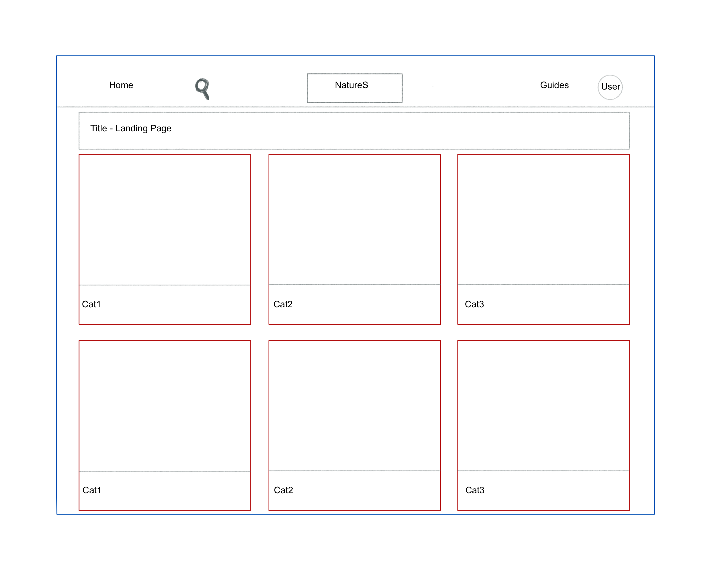
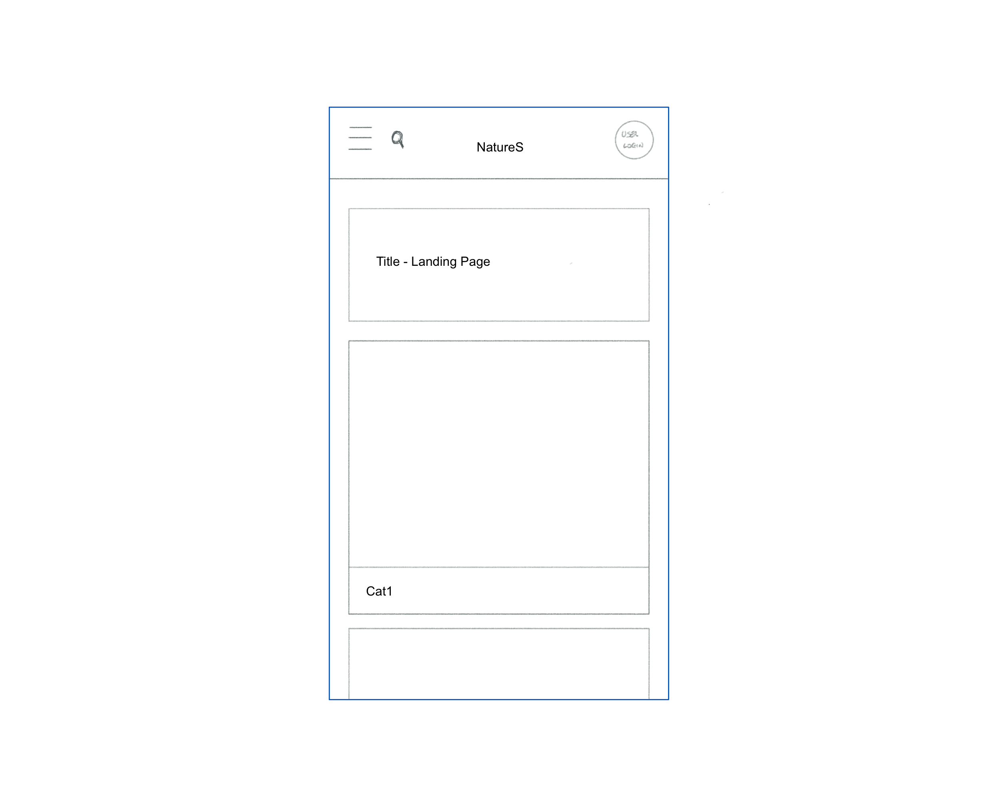
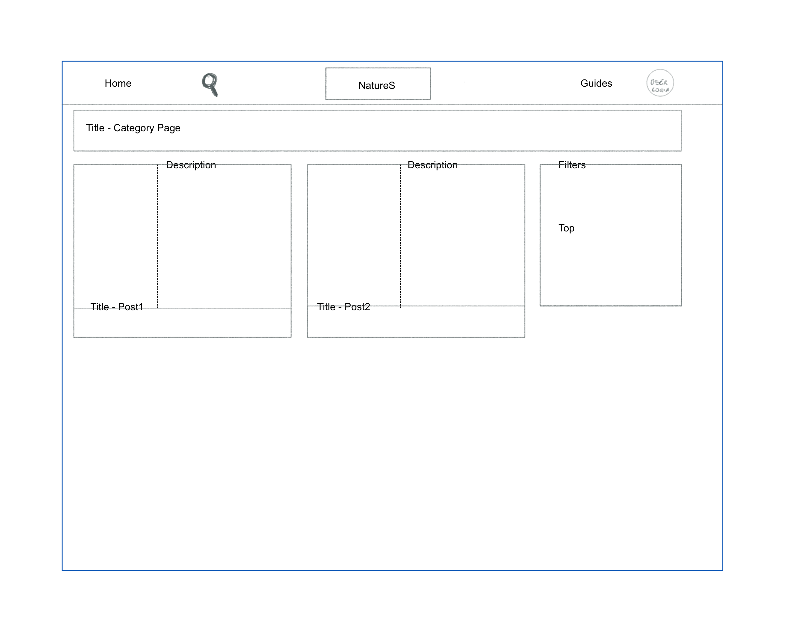
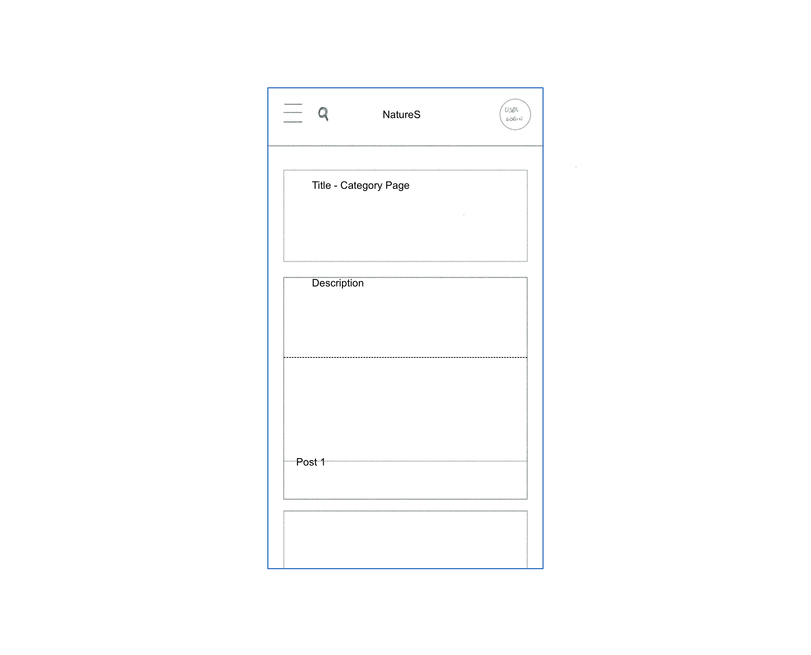
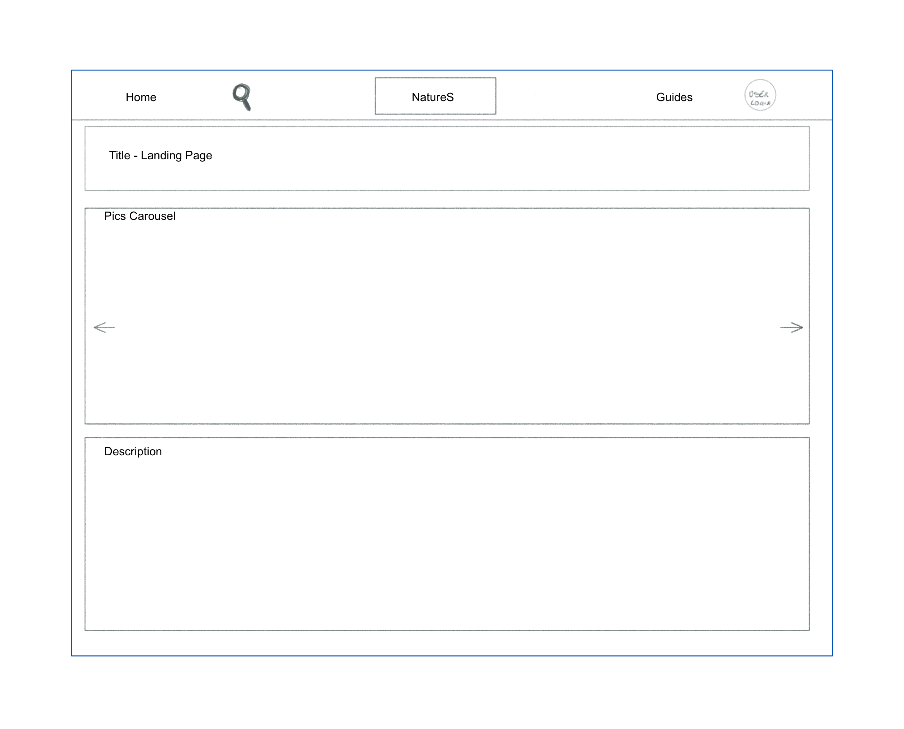
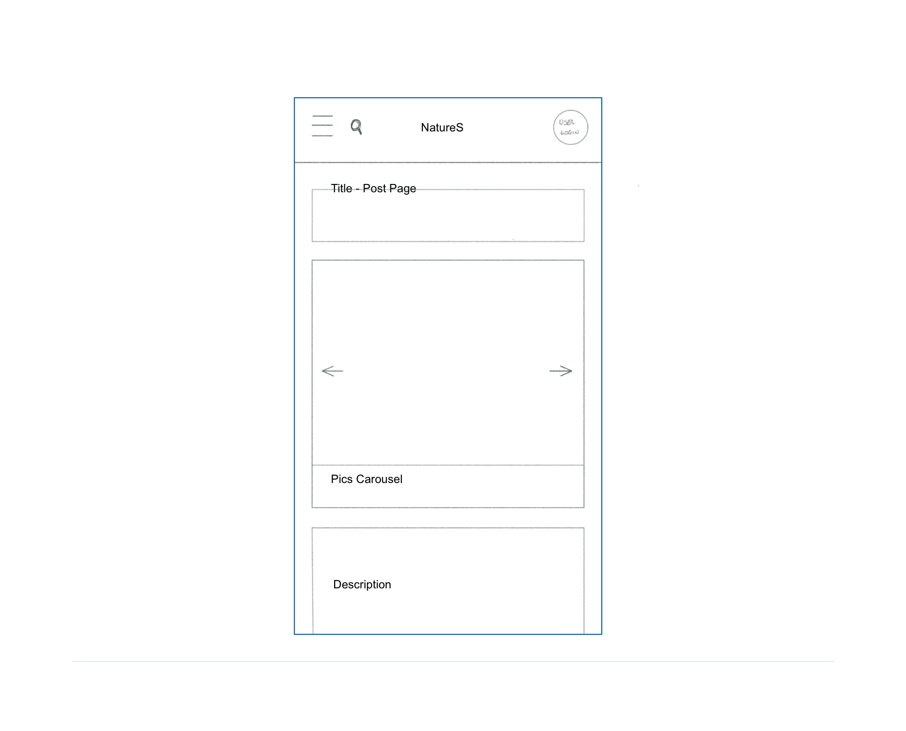
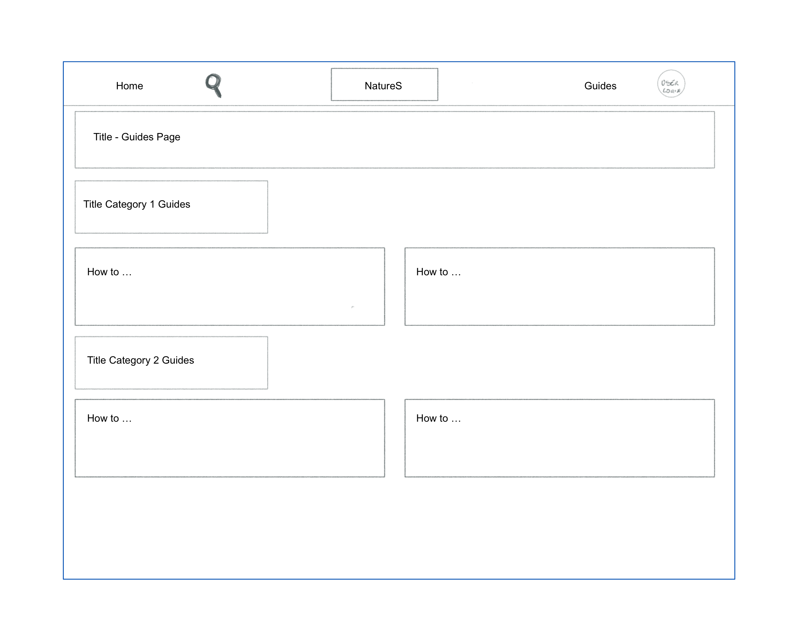
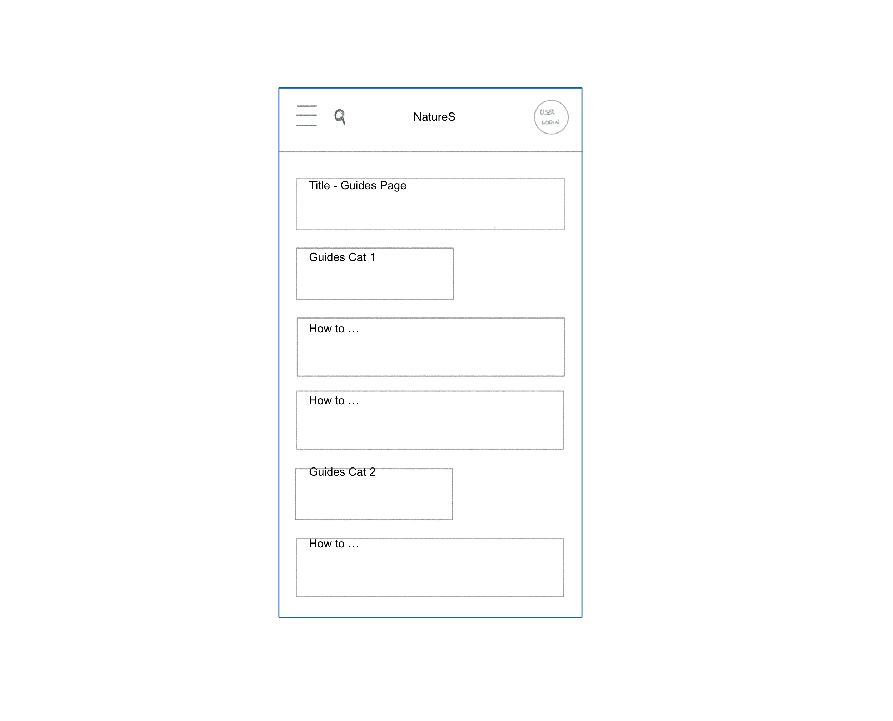

# Midterm Assignment Template

**Course:** 01VRP: Introduction to Web Applications (2025/2026)

## Student Information

- **Name:**  Giorgio Agnello
- **Student ID:**  322607

## Proposal

NatureS is a small static prototype for sharing hiking trails, trip reports and practical local guides. The site focuses on discoverability through large, image-forward cards and clear, readable content: a landing page that highlights categories, a Hiking index with preview tiles, individual post pages with hero images and overlays, and a Guides index with reference content. My goal is to practice with design modulations and use the most from Bootstrap.

## Main Changes

I found the lab exercises really helpful and tried to be inspired from them rather than just copying examples. The major changes comes from exploring the design possibilities and experiment with new combinations of it.

## Hand-Drawn Sketch

Include below **one image of a hand-drawn sketch**, produced before starting the implementation, showing the layout or interface idea you planned to develop.

<!-- Insert your image here -->
<!-- Example:  -->

## Project Structure

List the main files included in your submission.

- `index.html`
- `style.css`

## Additional Notes

Add any extra comments you would like to include about your work.
